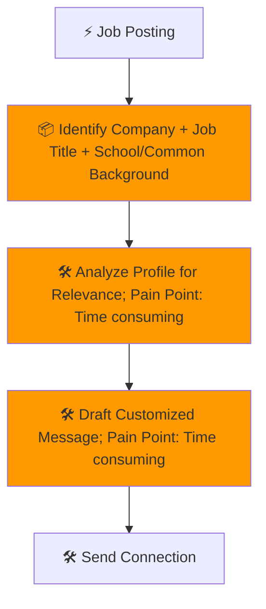
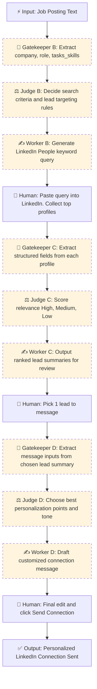

#  Process Design Document (PDD) - Milestone 2: MVW Design


### Process Design Document (PDD) - Phase 1 Complete
**Team Name:** Group #2

**Project Title:** LinkedIn Lead Generator

**Status:** Milestone 2 (Solution Design)

---

## [Part 1: Process Analysis]
# Process Design Document (PDD) - Milestone 1: Process Analysis
**Team Name:** Group 2
**Project Title:** LinkedIn Lead Generator
**Target Workflow:** Personal Daily Task

---

## Part 1: Process Mapping (The "As-Is" State)

### 1.1 The Scenario
A student wants to improve chances in the job market by manually generating leads on LinkedIn to connect with professionals who may provide referrals, insights, or interview opportunities. The process involves multiple manual steps, from identifying relevant profiles to drafting and sending personalized connection requests.

For each job posting, the student must extract key details, search for professionals at the company, evaluate their relevance, and write a customized message. Because personalization is required for every outreach attempt, the time required increases with the number of leads pursued.


### 1.2 The "As-Is" Diagram (Mermaid)



### 1.3 Pain Point Diagnosis
*   **The Bottleneck:** The main bottleneck occurs between "Identifying Company + Job Title + School/Common Background", “Analyze Profile” and “Draft Customized Message.” This stage requires reviewing unstructured profile information, exercising judgment about strategic value, and writing a personalized outreach message. It is the most cognitively demanding and time-intensive step, and it must be repeated for every potential connection.

*   **The Cost:** The student typically attempts 8–12 outreach connections per week. Profile analysis takes approximately 3–5 minutes per person, and drafting a customized message takes 7–10 minutes. This results in approximately 2–3 hours per week spent primarily on evaluation and message drafting, representing roughly 70–80% of total process time. Additional costs include cognitive fatigue, inconsistent message quality, and reduced outreach volume due to overthinking.

---

## Part 2: Opportunity Analysis (The Business Case)


### 2.1 The 3-Filter Analysis
| Activity                                                             | Pain (1-10) | Feasibility (1-10) | Risk (1-10) | Rationale                                                                                                       |
| -------------------------------------------------------------------- | ----------- | ------------------ | ----------- | --------------------------------------------------------------------------------------------------------------- |
| Evaluate profile for relevance                                       | 9           | 8                  | 4           | Requires interpreting unstructured profile information, identifying shared background, and judging strategic value. Highly repetitive and cognitively demanding. |
| Draft personalized message                                           | 9           | 8                  | 5           | Writing customized outreach is time-intensive and mentally taxing. Message quality directly impacts response rates. AI can generate strong drafts while preserving human review due to hallucination and tone ajustment risks.  |
| Search LinkedIn for relevant professionals                           | 7           | 8                  | 4           | Filtering by company, title, and shared background is structured and repeatable. AI can improve efficiency through ranking and prioritization. |
| Extract company + role + criteria from job posting                   | 6           | 9                  | 3           | Information extraction from job descriptions is well-suited for AI summarization and structured output generation. |
| Send connection request                                              | 4           | 9                  | 6           | Technically easy to automate, but full automation increases platform and account risk. Human control is preferred. |

### 2.2 The "Why AI?" Justification
| Activity                                           | Recommended Approach | Reasoning                                                                                                  |
| -------------------------------------------------- | -------------------- | ---------------------------------------------------------------------------------------------------------- |
| Extract company + role + criteria                  | AI / Automation      | AI can quickly summarize job postings and extract structured information needed for targeting relevant professionals. |
| Search and rank relevant professionals             | AI / Automation      | AI can filter and prioritize candidates based on structured criteria such as company, role, and shared background. |
| Evaluate profile for relevance                     | AI-assisted (Hybrid) | AI can summarize profile highlights and identify alignment signals, reducing review time while allowing human validation. |
| Draft personalized message                         | AI-assisted (Hybrid) | AI can generate tailored draft messages using extracted profile data, reducing cognitive load and drafting time. Human review maintains authenticity. |
| Send connection request                            | Human                | Final sending remains human-controlled to reduce platform risk and ensure intentional outreach. |
---

## Part 3: Scope of Automation (The Setup for Week 3)


### 3.1 The Target Zone
From the AS-IS workflow, the Minimal Viable Workflow (MVW) we identified was:

Automate: Extract job criteria → Search and rank relevant professionals → Summarize profile highlights → Generate draft personalized message

Keep Human: Final evaluation of strategic fit → Final message edits → Sending connection requests

Summary Table:
| Step                                         | Current Responsibility | TO-BE Responsibility                |
| -------------------------------------------- | ---------------------- | ----------------------------------- |
| Extract company + role + criteria            | Human                  | AI                                  |
| Search for professionals                     | Human                  | AI-assisted                         |
| Evaluate profile for relevance               | Human                  | AI-assisted + Human validation      |
| Draft personalized message                   | Human                  | AI-assisted + Human refinement      |
| Send connection request                      | Human                  | Human                               |


### 3.2 The Hypothesis
*   By automating job criteria extraction, candidate filtering, and first-draft message generation, we expect to reduce the time spent on profile evaluation and drafting by approximately 50–70%. This would reduce total weekly effort from approximately 2–3 hours to approximately 1–1.5 hours per week, while maintaining or improving message quality and consistency through structured AI support and human review.

---

## Part 2: The "To-Be" Solution (Milestone 2)

### 2.1 The "To-Be" Map


---

### 2.2 The R.A.F.T. Implementation (The Prompts)

**Automating Step B: Identify Company + Job Title + School/Common Background**

**Prompt 1 (Gatekeeper):**
```
#### Role
Gatekeeper AI: Extractor of relevant job posting information

#### Audience
Machine (downstream Judge node)

#### Format
JSON:
{
  "company": "",
  "role": "",
  "tasks_skills": ""
}

#### Task
- Receive the unstructured text of a job posting.
- Extract all relevant information required to identify potential leads:
  - Company name
  - Type of role
  - Key tasks and skills required
- Output the extracted information in JSON format.
- Do not make assumptions; extract only explicit or strongly implied information from the job posting.
- If a field cannot be populated from explicit job posting content, return null for that field.
- Output RAW JSON ONLY. Do not include commentary or explanation.

```
**Prompt 2 (Judge):**
```
#### Role
Judge AI: Reasoning engine to determine best parameters for identifying leads

#### Audience
Machine (downstream Worker node)

#### Format
XML with tags:
<thinking> ... </thinking>
<verdict> ... </verdict>

#### Task
- Receive JSON output from Gatekeeper (company, role, tasks/skills).
- Receive the unstructured text of a LinkedIn profile (student searching for people to network with)
- Determine the most effective parameters to identify relevant leads, including:
  - People at the same company or related industry
  - Shared university
  - Similar skills as described in the job posting
- Explain reasoning in the <thinking> tag.
- Provide final recommended search parameters in the <verdict> tag.
- Ensure all reasoning is explicit to prevent skipping logic.

```
**Prompt 3 (Worker):**
```
#### Role
Worker AI: Lead Search Query Generator

#### Audience
Human or Machine (ready-to-use LinkedIn search)

#### Format
Plain Text

#### Task
- Receive:
  - JSON from Gatekeeper
  - XML from Judge (<verdict>)
- Combine inputs to generate a single LinkedIn Boolean search string that can be pasted directly into LinkedIn.
- Ensure the string is fully formed, with no placeholders, and captures all relevant filters: company, role, skills, education, and additional parameters.
- Maintain clarity and proper Boolean syntax so it runs immediately in LinkedIn.

- Receive:
    - JSON from Gatekeeper
    - XML from Judge (<verdict>)
- Combine inputs to generate a single LinkedIn People keyword search string that can be pasted directly into LinkedIn.
- The output must be bullet-proof for LinkedIn parsing and return results without requiring manual filters.
- LinkedIn Parsing Constraints (MANDATORY)
    - Maximum length: ≤ 200 characters.
- Structure:
    - One parenthetical OR block for job titles only. Followed by space-separated keywords (no additional parentheses).
- Boolean rules:
    - DO NOT use nested parentheses.
    - DO NOT use multiple AND operators.
    - DO NOT use NOT.
    - Use spaces as implicit AND.

- Content prioritization:
    - Include 3–5 realistic LinkedIn job titles derived from the verdict.
    - Include 2–3 high-frequency skills that commonly co-occur in profiles (e.g., Python, LLM, NLP, chatbot, generative AI).
    - Avoid rare tools, long phrases, or education terms.

- Language normalization: Prefer terms people actually write on profiles (e.g., LLM instead of “large language model”, chatbot instead of “conversational AI system”).

- Output rules:
    - Output one single line
    - No explanations
    - No labels
    - No filters
    - No placeholders

```
**Automating Step C: Analyze Profiles for Relevance**
**Prompt 1 (Gatekeeper):**
```
#### Role
Gatekeeper AI: Extractor of lead profile information

#### Audience
Machine (downstream Judge node)

#### Format
JSON:
{
  "name": "",
  "current_company": "",
  "current_role": "",
  "skills": [],
  "interests": [],
  "university": ""
}

#### Task
- Receive a list of LinkedIn profiles and info generated from a query 
  (Headline, Activity, Job Experience, Skills, Education).
- Extract structured facts relevant for evaluating lead relevance:
  - Name
  - Current company
  - Current role
  - Skills
  - Interests
  - University
- Output as JSON for downstream reasoning.

#### Grounding Guardrail — STRICT PROFILE-BOUND EXTRACTION
- ONLY extract words, phrases, and concepts that appear verbatim or are 
  directly and explicitly stated in the individual's profile text 
  (headline, experience descriptions, skills section, education, and 
  their own posts/comments).
- DO NOT infer, inherit, or import any terms from the search query, 
  job postings, reposts, or other people's content that appears in 
  the profile's activity feed.
- If a field cannot be populated with profile-sourced data, return null 
  rather than inferring a plausible value.
- Before writing any value, ask internally: 
  "Did THIS person write or claim this — or did it come from somewhere else?"

#### Source Hierarchy (in order of trust)
1. Profile headline
2. Own experience descriptions
3. Skills section (explicitly listed)
4. Education section
5. The person's OWN posts and comments
6. Reposts of others' content — DO NOT use as a source
7. Search query terms — DO NOT use as a source

```
**Prompt 2 (Judge):**
```
#### Role
Judge AI: Evaluate lead relevance

#### Audience
Machine (downstream Worker node)

#### Format
XML with tags:
<thinking> ... </thinking>
<verdict> ... </verdict>

#### Task
- Receive JSON from Gatekeeper.
- Compare lead profile with job posting criteria and search parameters.
- Provide reasoning in <thinking>, highlighting matches and gaps in:
  - Company/industry
  - Role similarity
  - Skills alignment
  - University/education
  - Interests
- Provide final relevance verdict in <verdict> as High, Medium, or Low.
- Ensure explicit reasoning to prevent skipping steps.


```
**Prompt 3 (Worker):**
```
#### Role
Worker AI: Lead Profile Summarizer

#### Audience
Human (review for prioritization)

#### Format
Plain Text

#### Task
- Receive:
  - JSON from Gatekeeper
  - XML from Judge (<thinking> + <verdict>)
- Combine inputs to generate a concise, human-readable summary of the lead profile:
  - Current Company
  - Current Role
  - Skills
  - Interests
  - University
  - Relevance verdict
- Output should be easy to read and ready for human review.

```
**Automating Step D: Draft Customized Message**
**Prompt 1 (Gatekeeper):**
```
#### Role
Gatekeeper AI: Extractor for message drafting

#### Audience
Machine (downstream Judge node)

#### Format
JSON:
{
  "company": "",
  "role": "",
  "skills": [],
  "interests": [],
  "university": "",
  "relevance": ""
}

#### Task
- Receive Lead Summary from Step C (Plain Text).
- Parse and structure all relevant fields for message drafting:
  - Company, Role, Skills, Interests, University, Relevance
- Output as JSON for downstream Judge and Worker nodes.

```
**Prompt 2 (Judge):**
```
#### Role
Judge AI: Message Personalization Strategist

#### Audience
Machine (downstream Worker node)

#### Format
XML with tags:
<thinking> ... </thinking>
<verdict> ... </verdict>

#### Task
- Receive JSON from Gatekeeper.
- Determine:
  1. Which profile points are most persuasive to include.
  2. Appropriate tone/focus based on relevance.
  3. Rank personalization priorities (university, skills, role, company, interests).
- Provide detailed reasoning in <thinking>.
- Output recommended points and tone in <verdict> for message drafting.


```
**Prompt 3 (Worker):**
```
#### Role
Worker AI: Personalized Message Generator

#### Audience
Human (to review before sending)

#### Format
Plain Text

#### Task
- Receive:
  - JSON from Gatekeeper
  - XML from Judge (<thinking> + <verdict>)
- Generate a fully drafted, human-friendly, ready-to-send personalized message:
  - Include highlighted persuasive points (university, skills, role, company)
  - Apply tone recommended by Judge
- Output should be immediately readable, editable, and ready for human review before sending.
```

---

### 2.3 The Tool Specifications (The Engineer's Audit)
*Now, audit your prompts above against these strict Engineering Specs. Does your prompt actually deliver what the Spec demands?*

#### **Step B | Tool A: The Gatekeeper (Extraction)**
*   **Goal:** Extract structured data from job posting.
*   **Input Variable:** `{job posting description}´ (String, unstructured text)
*   **Output Schema (JSON):**
    * `company`: (string | null),
    * `role`: (string | null),
    * `tasks_skills`: (string | null)
 
*   **Failure Mode:** If no information was extracted, output `null` across all fields.

#### **Step B | Tool B: The Judge (Reasoning)**
*   **Goal:** Establish criteria to find relevant people.
*   **Input Variable:** `{{json from previous rules}}`
*   **Context Rules:**
*   - Use only the fields provided in `{{extracted_json}}`.
  - Do NOT infer missing information.
  - Do NOT introduce new data not present in the JSON.
  - Base reasoning strictly on:
    - `company`
    - `role`
    - `tasks_skills`
  - Explicitly explain how job role and required skills translate into:
    - Target job titles
    - Target industries
    - Target skill keywords
    - Target seniority level (if implied)
*   **Output Schema (XML):**`<thinking>` and `<verdict>`

#### **Step B | Tool C: The Worker (Drafting)**
*   **Goal:** Generate the ready-to-paste LinkedIn query.
*   **Input Variable:** `{{verdict}}` (Search criteria produced by Tool B)
*   **Tone/Style:** Single Boolean LinkedIn Query

#### **Step C | Tool A: The Gatekeeper (Extraction)**
*   **Goal:** Extract information from LinkedIn profiles returned in Query.
*   **Input Variable:** `{list of profiles and information}´ (String)
*   **Output Schema (JSON):**
    * `name`: (string | null),
    * `current_company`: (string | null),
    * `current_role`: (string | null),
    * `skills`: (array of strings | null),
    * `interests`: (array of strings | null),
    *  `university`: (string | null)

*   **Failure Mode:** If no information was extracted, output null across all fields.

#### **Step C | Tool B: The Judge (Reasoning)**
*   **Goal:** Assign relevance scores to generated leads.
*   **Input Variable:** `{{json with lead information}}`
*   **Context Rules:** Sticking to JSON output from previous node
*   **Output Schema (XML):**
*   `<thinking>`: reasoning for each evaluated lead
*   `<verdict>`: structured relevance assignment per lead

#### **Step C | Tool C: The Worker (Drafting)**
*   **Goal:** Summarize the lead information and relevance assignment for human review.
*   **Input Variable:** `{{verdict}}`
*   **Tone/Style:** Text for human review, straightforward.

#### **Step D | Tool A: The Gatekeeper (Extraction)**
*   **Goal:** Extract structured fields from selected lead summary for message drafting.
*   **Input Variable:** `{{lead_summary_text}}` (String)
*   **Output Schema (JSON):**
    * `name`: (string | null),
    * `current_company`: (string | null),
    * `current_role`: (string | null),
    * `skills`: (array of strings | null),
    * `interests`: (array of strings | null),
    * `university`: (string | null)

*   **Failure Mode:** If no information was extracted, output null across all fields.

#### **Step D | Tool B: The Judge (Reasoning)**
*   **Goal:** Assign relevance scores to generated leads.
*   **Input Variable:** `{{json with lead information}}`
*   **Context Rules:** Sticking to JSON output from previous node
*   **Output Schema (XML):** `<thinking>` and `<verdict>`

#### **Step D | Tool C: The Worker (Drafting)**
*   **Goal:** Summarize the lead information and relevance assignment for human review.
*   **Input Variable:** `{{verdict}}`
*   **Tone/Style:** Text for human review, straightforward.
---

### 2.4 "Proof of Life" (Simulation Log)

#### Step B
> **Input:** 
> `{{About the job About the role: Join our fast-growing Global Product Management Data Science team and help transform Gartner’s Client Experience Digital Platform—the essential destination for IT and business leaders worldwide. As a data scientist, you’ll leverage advanced analytics and machine learning to create intelligent, scalable solutions that deliver real value and enhance every step of our clients’ journey. In this role, you will lead complex data science projects in partnership with cross-functional teams, driving the development of advanced AI-powered chatbot systems that deliver intelligent, personalized experiences at scale. You’ll architect and implement cutting-edge conversational AI tools—including intelligent search, recommendation engines, and context-aware content systems—while ensuring seamless integration with enterprise platforms. What You Will Do Lead data science projects in close collaboration with Data Engineering, Application development, Product owners and business leaders to deliver high-value business capabilities Architect and build sophisticated AI-powered chatbot systems that provide intelligent, personalized client experiences at scale Design and implement advanced tools that power conversational AI capabilities, including intelligent search, recommendation engines, and context-aware content retrieval systems Design and implement Model Context Protocol (MCP) servers to enable seamless integration between AI agents, enterprise systems, and external tools Build user profiling and personalization models to deliver tailored chatbot experiences Be accountable for high-quality data science solutions with respect to accuracy, coverage, scalability, stability, and business adoption Take ownership of algorithms and drive enhancements/optimizations based on business requirements with proper documentation and code-reusability Leverage internal and external data to understand client's company-level priorities and deliver targeted support Collaborate with senior leadership on long-term vision, strategy, and solution roadmaps aligned with business objectives Pitch ideas, present solutions, and influence senior leaders and executive stakeholders with strong business value propositions Stay on top of fast-moving AI/ML models and technologies, particularly in LLMs, conversational AI, and agentic systems Collaborate with engineering and product teams to launch MVPs and iterate quickly Independently plan and drive complex data science projects that deliver measurable business value Mentor junior data scientists on chatbot development, LLM applications, and best practices What You Will Need 6-8 years hands-on experience building conversational AI systems, chatbots, LLM applications, or other advanced machine learning/artificial intelligence solutions to drive business impact Master's Degree or PhD in a quantitative field (math, computer science, engineering, etc.) required Strong communication skills in technical and business domains with demonstrated ability to translate quantitative analysis into actionable business strategies and influence executive leadership Working experience in some of the following data science areas: Large Language Models (LLMs) and Generative AI Conversational AI, chatbot development, and dialogue systems Natural Language Processing and text mining Search and Recommendation systems Prompt engineering, LLM fine-tuning, and model optimization AI agent architectures and orchestration Strong familiarity with Model Context Protocol (MCP) and building tools for AI agents Deep understanding of Lean product principles, software development lifecycle, and machine learning life cycle Practical, intuitive problem solver with proven ability to translate business objectives into actionable data science tasks and implement state-of-the-art ML research into production systems Experience and proficiency with Python, machine learning tools (e.g., scikit-learn, spacy, nltk), deep learning frameworks (e.g., pytorch, tensorflow, huggingface), LLM frameworks (e.g., LangChain, LlamaIndex), SQL/relational databases (e.g., Oracle), NoSQL databases (e.g., MongoDB, graph database), vector databases (e.g., Pinecone, Weaviate), distributed machine learning (spark), Linux and shell scripting Experience with cloud computing services such as AWS or Azure ML Strong ability to work collaboratively across product, data science and technical stakeholders with experience mentoring data scientists Ability to work in a culture that thrives on feedback and seeks opportunities to stretch outside comfort zone Bias for action and client outcome oriented What You Will Get Competitive salary, generous paid time off policy, charity match program, Group Medical Insurance, Parental Leave, Employee Assistance Program (EAP) and more! Collaborative, team-oriented culture that embraces diversity Professional development and unlimited growth opportunities Who are we? At Gartner, Inc. (NYSE:IT), we guide the leaders who shape the world. Our mission relies on expert analysis and bold ideas to deliver actionable, objective business and technology insights, helping enterprise leaders and their teams succeed with their mission-critical priorities. Since our founding in 1979, we’ve grown to 21,000 associates globally who support ~14,000 client enterprises in ~90 countries and territories. We do important, interesting and substantive work that matters. That’s why we hire associates with the intellectual curiosity, energy and drive to want to make a difference. The bar is unapologetically high. So is the impact you can have here. What makes Gartner a great place to work? Our vast, virtually untapped market potential offers limitless opportunities – opportunities that may not even exist right now – for you to grow professionally and flourish personally. How far you go is driven by your passion and performance. We hire remarkable people who collaborate and win as a team. Together, our singular, unifying goal is to deliver results for our clients. Our teams are inclusive and composed of individuals from different geographies, cultures, religions, ethnicities, races, genders, sexual orientations, abilities and generations. We invest in great leaders who bring out the best in you and the company, enabling us to multiply our impact and results. This is why, year after year, we are recognized worldwide as a great place to work. What do we offer? Gartner offers world-class benefits, highly competitive compensation and disproportionate rewards for top performers. In our hybrid work environment, we provide the flexibility and support for you to thrive — working virtually when it's productive to do so and getting together with colleagues in a vibrant community that is purposeful, engaging and inspiring. Ready to grow your career with Gartner? Join us. Gartner believes in fair and equitable pay. A reasonable estimate of the base salary range for this role is 113,000 USD - 147,000 USD. Please note that actual salaries may vary within the range, or be above or below the range, based on factors including, but not limited to, education, training, experience, professional achievement, business need, and location. In addition to base salary, employees will participate in either an annual bonus plan based on company and individual performance, or a role-based, uncapped sales incentive plan. Our talent acquisition team will provide the specific opportunity on our bonus or incentive programs to eligible candidates. We also offer market leading benefit programs including generous PTO, a 401k match up to $7,200 per year, the opportunity to purchase company stock at a discount, and more. The policy of Gartner is to provide equal employment opportunities to all applicants and employees without regard to race, color, creed, religion, sex, sexual orientation, gender identity, marital status, citizenship status, age, national origin, ancestry, disability, veteran status, or any other legally protected status and to seek to advance the principles of equal employment opportunity. Gartner is committed to being an Equal Opportunity Employer and offers opportunities to all job seekers, including job seekers with disabilities. If you are a qualified individual with a disability or a disabled veteran, you may request a reasonable accommodation if you are unable or limited in your ability to use or access the Company’s career webpage as a result of your disability. You may request reasonable accommodations by calling Human Resources at +1 (203) 964-0096 or by sending an email to ApplicantAccommodations@gartner.com. Job Requisition ID:106861 By submitting your information and application, you confirm that you have read and agree to the country or regional recruitment notice linked below applicable to your place of residence. Gartner Applicant Privacy Link: https://jobs.gartner.com/applicant-privacy-policy For efficient navigation through the application, please only use the back button within the application, not the back arrow within your browser.}}`
> 
> **Node 1 Output:**
> `{
>  "company": "Gartner",
> "role": "Data Scientist – Conversational AI / LLM",
>  "tasks_skills": "Lead end-to-end data science projects; architect and build AI-powered chatbot systems; develop conversational AI > tools (intelligent search, recommendation engines, context-aware content retrieval); design and implement MCP servers for AI agent >integration; build user profiling and personalization models; optimize and productionize ML/LLM models; collaborate with data >engineering, product, and business stakeholders; influence senior leadership and define AI strategy; mentor junior data scientists; >stay current with LLMs and agentic AI. Required skills include LLMs and generative AI, NLP, chatbot/dialogue systems, prompt >engineering, LLM fine-tuning, AI agents and orchestration, MCP, Python, scikit-learn, PyTorch/TensorFlow, Hugging Face, >LangChain/LlamaIndex, SQL/NoSQL, vector databases (Pinecone/Weaviate), Spark, Linux, AWS/Azure ML, strong communication, and >product/ML lifecycle knowledge."
}`
> 
> **Node 2 Verdict:** ````xml
<thinking>
I will integrate both inputs: (1) job requirements and (2) job searcher profile, then derive lead identification parameters.

STEP 1 — Target Role Analysis
The Gartner role is a highly technical Data Scientist position focused on:
- Conversational AI, LLMs, NLP
- Recommendation/search systems
- AI architecture and ML engineering stack
- Product-facing data science
- Cross-functional leadership
This implies leads should be technically senior and embedded in AI product environments.

STEP 2 — Job Searcher Profile Analysis
The candidate is NOT a hands-on ML engineer but a:
- Senior Product Developer (E-mobility digital products)
- Data & AI Strategy Consultant (operating models, governance, AI use-case identification)
- Business-facing, cross-functional, stakeholder-heavy roles
- Currently pursuing MS in Business Analytics with Python/SQL exposure
Strengths:
- Product management for digital/AI-adjacent products
- AI strategy, governance, operating models
- Workshops, C-level communication, roadmap definition
- Utilities and energy domain
- Analytics education (in progress)

Gap vs role:
- Limited evidence of hands-on LLM/NLP model building
- Strong in product + AI strategy layer, not deep ML engineering

Therefore, optimal leads are NOT only pure Data Scientists, but:
- Product Data Scientists
- Applied AI Product Managers
- Conversational AI Product Leads
- AI Strategy leaders inside technical teams
These profiles bridge product + AI and are more likely to respond and provide referrals.

STEP 3 — Company Targeting Logic
Primary:
- Gartner (direct internal referrals)

Secondary (industry adjacency):
Companies with:
- AI-powered products
- Conversational AI platforms
- Strong product-data collaboration
Examples: Microsoft, Amazon, Google, Salesforce, ServiceNow, IBM, OpenAI, startups in conversational AI.
These environments mirror Gartner’s product data science org.

STEP 4 — Skill Overlap Matching
We should match on:
From job:
- Conversational AI, LLMs, NLP, recommendation systems
From candidate:
- AI strategy, product roadmaps, cross-functional AI delivery, data governance, analytics
Intersection leads to:
- Product-facing AI roles
- AI platform product teams
- Data science teams working with PMs

STEP 5 — University Signal
Candidate universities:
- Fairfield University (current MS)
- KU Leuven (MSc Economics)
Shared university filters increase response probability, especially:
- Fairfield alumni in tech/data roles in US
- KU Leuven alumni in AI/data in Europe/US

STEP 6 — Seniority Band
Role requires 6–8 years experience.
Candidate has ~6+ years total.
Therefore leads should be:
- Senior Data Scientist
- Staff/Lead Data Scientist
- AI Product Manager
- Principal DS (not Directors)

Peer-level increases response likelihood.

STEP 7 — Functional Context Filters
High-priority environments:
- AI product teams
- Data science within product orgs
- Personalization/search/recommendation teams
- Conversational AI platforms

STEP 8 — Outreach Relevance Logic
Leads most likely to engage:
- Product + Data hybrid backgrounds
- Former consultants now in DS/product
- Utilities/energy AI teams (domain overlap)
- People who transitioned from strategy to technical AI roles

This alignment creates a credible narrative for the candidate.

FINAL PARAMETER PRIORITIZATION (by weight):
1. Same company (Gartner) in Data Science, AI Product, or Product Analytics
2. Product-facing Data Scientists in conversational AI / NLP / personalization
3. AI Product Managers in LLM or chatbot platforms
4. Shared universities (Fairfield, KU Leuven)
5. Former consultants now in DS/AI roles
6. Utilities/energy AI product teams
7. Seniority: Senior IC (5–9 years experience)

This produces high-relevance, high-response-probability leads.
</thinking>
<verdict>
SEARCH PARAMETERS:

Company:
- Gartner (primary)
- Microsoft, Amazon, Google, Salesforce, ServiceNow, IBM, OpenAI, conversational AI startups (secondary)

Roles:
- Senior Data Scientist (Product / Personalization / NLP / Conversational AI)
- Product Data Scientist
- Applied Scientist (Conversational AI / LLM)
- AI Product Manager (LLM / Chatbots / Personalization)
- Machine Learning Scientist in product teams

Skills Keywords:
- Conversational AI, LLMs, NLP
- Recommendation systems, search, personalization
- Python, SQL, ML frameworks
- LangChain, LlamaIndex, vector databases
- AI product analytics, experimentation
- AI platform product development

Background Signals:
- Product + Data cross-functional experience
- Former consultants now in AI/data roles
- Experience translating business needs into ML products
- Mentorship or tech leadership at IC level

Education Filters:
- Fairfield University alumni in tech/data roles
- KU Leuven alumni in data/AI/analytics roles
- Master’s or PhD in analytics, data science, AI, statistics, economics

Industry Filters:
- AI product companies
- SaaS platforms with conversational AI features
- Utilities/energy AI teams (for domain overlap)

Seniority:
- 5–9 years experience
- Senior IC (not Director/VP)

Geography:
- United States (primary)
- Europe (secondary for KU Leuven network)
</verdict>
```
`

> **Final Output:** ´("Data Scientist" OR "Applied Scientist" OR "AI Product Manager" OR "Product Data Scientist" OR "Conversational AI Lead") LLM NLP chatbot personalization Gartner´

#### Step C
> **Input:** 
> `{================================================================================
LINKEDIN PROFILES - MERGED
Query: "Data Scientist" OR "Applied Scientist" OR "AI Product Manager" OR 
"Product Data Scientist" OR "Conversational AI Lead") LLM NLP chatbot personalization Gartner
================================================================================

--------------------------------------------------------------------------------
PROFILE 1: Zixiao Chen
--------------------------------------------------------------------------------
Name:             Zixiao Chen
Current Role:     Applied Scientist II
Current Company:  Microsoft
Location:         New York, New York, United States
University:       New York University (MS, Data Science, 2020–2022)
                  Rotterdam School of Management, Erasmus University (MS, Business Information Management, 2019–2020)

EXPERIENCE:
- Applied Scientist II | Microsoft | Dec 2024 – Present | New York, US
- Data Scientist II | McKinsey & Company | Jul 2022 – Nov 2024 | New York, US
- Research Intern | NYU Langone Health | Aug 2021 – Nov 2021 | New York, US
- Research Intern | New York University | May 2021 – Aug 2021 | New York, US
- Intern | Microsoft | Sep 2018 – Nov 2018 | Beijing

SKILLS:
- Data Science, Machine Learning, NLP

INTERESTS/ACTIVITY:
- AI/ML research, Information integrity, Recommender systems
- Reposted content on AI and information integrity research
- Announced Applied Scientist II role at Microsoft (Dec 2024)

--------------------------------------------------------------------------------
PROFILE 2: Fábio Maltêz
--------------------------------------------------------------------------------
Name:             Fábio Maltêz
Current Role:     Product Manager I - Private Capital
Current Company:  McKinsey & Company
Location:         New York, New York, United States
University:       ISCTE - Instituto Universitário de Lisboa (MSc, Data Science, 2020–2022, Grade: 18/20)
                  ISCTE Business School (Bachelor's, Management, 2017–2020, Grade: 17/20)

EXPERIENCE:
- Product Manager I - Private Capital | McKinsey & Company | May 2025 – Present | New York, US
- Senior Product Analyst - Private Capital | McKinsey & Company | Mar 2024 – May 2025 | Lisbon, Portugal
- Private Equity Senior Analyst | McKinsey & Company | Nov 2023 – Mar 2024 | Lisbon, Portugal
- Private Equity Analyst | McKinsey & Company | May 2022 – Nov 2023 | Lisbon, Portugal
- Intern Data Analyst | Portland Hill Capital | Apr 2021 – Apr 2022 | Lisbon, Portugal
- Monitor, Dept. of Quantitative Methods | ISCTE | Sep 2020 – Jun 2021
- FSO Assistant | EY | Jan 2021 – Feb 2021 | Lisbon, Portugal
- Board President | ITIC - ISCTE Trading & Investment Club | Jun 2019 – Jun 2020

SKILLS:
- AI Product Management, LLMs, Agentic AI, Deep Reinforcement Learning, Python, Data Science, Product Analytics, Product Management, Excel Modeling

INTERESTS/ACTIVITY:
- AI in Finance, LLMs for investment workflows, Private Equity tech, AI ethics
- Shared research on Agentic AI, LLMs and data management in investment contexts (Man Group, Bridgewater, CFA Institute, Two Sigma publications)
- Recently completed DeepLearning.AI certifications: Neural Networks & Deep Learning; Hyperparameter Tuning, Regularization and Optimization

CERTIFICATIONS:
- Neural Networks and Deep Learning | DeepLearning.AI
- Improving Deep Neural Networks: Hyperparameter Tuning, Regularization and Optimization | DeepLearning.AI

--------------------------------------------------------------------------------
PROFILE 3: Aayush Khemka
--------------------------------------------------------------------------------
Name:             Aayush Khemka
Current Role:     Data Scientist
Current Company:  Amazon Web Services (AWS)
Location:         New York City Metropolitan Area
University:       University of Connecticut School of Business (MS, Business Analytics and Project Management, 2015–2016)
                  Jadavpur University (B.Tech, Information Technology, 2007–2011)

EXPERIENCE:
- Data Scientist | Amazon Web Services (AWS) | Aug 2021 – Present | Seattle, WA
- Senior Manager, Data Science | PepsiCo | Mar 2020 – Aug 2021 | Plano, TX
- Manager, Data Science | PepsiCo | Jan 2018 – Mar 2020 | Fayetteville, AR
- Associate Manager, Advanced Analytics | PepsiCo | Aug 2016 – Jan 2018 | New York, US
- Business Analyst | GENPACT | May 2013 – Jul 2015 | Bengaluru, India
- Senior Business Analyst | Mu Sigma | Jun 2011 – Apr 2013 | Bangalore, India

SKILLS:
- Machine Learning, Statistical Analysis, Predictive Modeling, Python, R, SAS (Base, E.Guide, Miner, JMP), Tableau, NLP, Text Mining, Hadoop, Pig, Hive, PL/SQL, MS Excel
- Logistic/Linear Regression, Random Forest, Gradient Boosting, Neural Networks, Decision Trees, Ensemble Models, Bootstrapping
- Data Mining, Forecasting, Segmentation, Market Basket Analysis, Web Analytics, Network Modeling, Scenario Planning

INTERESTS/ACTIVITY:
- Predictive Modeling, Forecasting, Consumer Segmentation, Demand Space analysis, Cross-sell/Up-sell analytics

--------------------------------------------------------------------------------
PROFILE 4: Bryon Kucharski
--------------------------------------------------------------------------------
Name:             Bryon Kucharski
Current Role:     Lead Data Scientist
Current Company:  Gartner
Location:         New Haven, Connecticut, United States
University:       University of Massachusetts Amherst (MS, Computer Science, 2018–2020)
                  Wentworth Institute of Technology (BS, Computer Engineering, 2014–2018, GPA: 3.82)

EXPERIENCE:
- Lead Data Scientist | Gartner | Feb 2024 – Present | Remote
  · Lead DS on AskGartner (AI-powered tool for Gartner insights access)
  · Tech lead for search and retrieval projects on gartner.com
- Senior Data Scientist | Gartner | Sep 2022 – Feb 2024 | Remote
  · Created AskGartner
  · AI-powered information retrieval and LLMs for gartner.com
- Senior Data Scientist | JobTarget | Dec 2021 – Sep 2022 | Remote
  · Led NLP efforts: job description parsing, job/candidate matching, search & ranking, recommendations
  · Platforms: Vepsa, Elasticsearch, Milvus
- Data Scientist | Travelers | Jun 2020 – Dec 2021 | Hartford, CT
  · NLP: classification, question answering, abstractive summarization for customer service
- Intern, Human-Autonomy Interaction Lab | Sonalysts, Inc. | Jun 2019 – Aug 2019 | Waterford, CT
- Research Assistant Co-op | Wentworth Institute of Technology | Sep 2017 – Dec 2017 | Boston

SKILLS:
- NLP, LLMs, Search & Ranking, Recommendations, Information Retrieval, Python, Elasticsearch, Milvus, ML/DL frameworks, Conversational AI, Chatbots

INTERESTS/ACTIVITY:
- Conversational AI, Chatbots, AI-powered search, Personalization
- Actively involved in AskGartner rollout (recognized in Gartner Q2 2025 earnings call)
- Reposts Gartner AI/ML hiring and product content

--------------------------------------------------------------------------------
PROFILE 5: ZJ (Zhiheng) Jiang
--------------------------------------------------------------------------------
Name:             ZJ (Zhiheng) Jiang
Current Role:     Data Scientist
Current Company:  Meta
Location:         New York, New York, United States
University:       Columbia University (Master's, Data Science, 2020–2021)
                  UC San Diego (BS, Physics and Applied Mathematics, 2016–2020)

EXPERIENCE:
- Data Scientist | Meta | Feb 2025 – Present | New York, US (On-site)
- Data Scientist | NBCUniversal | Feb 2022 – Jan 2025 | New York, US
- Data Scientist Intern | Unilever | Jun 2021 – Sep 2021 | Trumbull, CT
  · Predictive models for consumer experience (R, Python)
  · Product recommendation model (Python/Django)
  · JMP script for consumer feedback prediction
  · ANOVA testing and data processing
- Undergraduate Researcher | UC San Diego | Apr 2018 – Jun 2020 | La Jolla, CA

SKILLS:
- Python, Causal Inference, Experimentation, Product Analytics, ML-driven Measurement, Data Analysis, R, Django, JMP, ANOVA

INTERESTS/ACTIVITY:
- Large-scale product analytics, Revenue & engagement systems, ML measurement, Causal inference
- Actively exploring new Data Scientist opportunities (comments on job posts)

CERTIFICATIONS:
- Introduction to Data Science in Python | Coursera (Aug 2019)

================================================================================
END OF PROFILES
================================================================================}`
> 
> **Node 1 Output:**
> `{[
  {
    "name": "Zixiao Chen",
    "current_company": "Microsoft",
    "current_role": "Applied Scientist II",
    "skills": ["Data Science"],
    "interests": ["Information integrity"],
    "university": "New York University"
  },
  {
    "name": "Fábio Maltêz",
    "current_company": "McKinsey & Company",
    "current_role": "Product Manager I - Private Capital",
    "skills": ["AI", "Data", "Innovation", "Python", "Machine Learning", "Deep Reinforcement Learning", "Product Management"],
    "interests": ["Entrepreneurship", "Strategy", "AI", "Product Management", "Investments", "LLMs", "Agentic AI", "Data Management"],
    "university": "ISCTE - Instituto Universitário de Lisboa"
  },
  {
    "name": "Aayush Khemka",
    "current_company": "Amazon Web Services (AWS)",
    "current_role": "Data Scientist",
    "skills": ["SAS", "R", "Python", "Tableau", "MS Excel", "PL/SQL", "Hadoop", "Pig", "Hive", "Statistical Analysis", "Exploratory Data Analysis", "Logistic Regression", "Linear Regression", "Random Forest", "Gradient Boosting", "Neural Networks", "Decision Trees", "Ensemble Models", "Bootstrapping"],
    "interests": ["Data Mining", "Forecasting", "Predictive Modeling", "Text Mining", "Social Network Analysis", "Web Analytics", "Segmentation", "Market Basket Analysis", "Network Modeling"],
    "university": "University of Connecticut School of Business"
  },
  {
    "name": "Bryon Kucharski",
    "current_company": "Gartner",
    "current_role": "Lead Data Scientist",
    "skills": ["NLP", "Search & Ranking", "Recommendations", "Elasticsearch", "Milvus", "LLMs", "Information Retrieval"],
    "interests": ["AI-powered information retrieval", "Search", "Chatbots"],
    "university": "University of Massachusetts Amherst"
  },
  {
    "name": "ZJ (Zhiheng) Jiang",
    "current_company": "Meta",
    "current_role": "Data Scientist",
    "skills": ["Python", "Data Analysis", "R", "Django", "JMP", "ANOVA"],
    "interests": ["Causal Inference", "Experimentation", "Product Analytics", "ML-driven Measurement", "Revenue", "Engagement"],
    "university": "Columbia University"
  }
]}`
> 
> **Node 2 Verdict:** `{<evaluation>

  <lead name="Zixiao Chen">
    <reasoning>
      <company_industry>Microsoft is a top-tier tech company — strong signal for technical talent. Relevant industry alignment.</company_industry>
      <role_similarity>Applied Scientist II is closely aligned with data science and ML-focused roles. Solid match for a data/AI-oriented position.</role_similarity>
      <skills_alignment>Only "Data Science" is listed — very sparse skill data. Limits confidence in depth of technical expertise, though the role title implies more.</skills_alignment>
      <university>New York University is a well-regarded research institution with strong data science programs. Positive signal.</university>
      <interests>Interest in "Information integrity" is niche and somewhat specialized. Could align well with trust/safety or ML fairness roles, but narrow otherwise.</interests>
    </reasoning>
    <verdict>Medium</verdict>
  </lead>

  <lead name="Fábio Maltêz">
    <reasoning>
      <company_industry>McKinsey & Company is a prestigious consulting firm — strong pedigree, though not a native tech/product company. Private capital focus adds a finance dimension.</company_industry>
      <role_similarity>Product Manager I with a private capital focus is a hybrid role. Relevant for product-oriented positions, especially those intersecting AI and finance.</role_similarity>
      <skills_alignment>Exceptionally well-rounded: AI, Python, Machine Learning, Deep Reinforcement Learning, Product Management, and Data. Strong alignment with technical product or AI roles.</skills_alignment>
      <university>ISCTE - Instituto Universitário de Lisboa is a solid European institution, less globally prominent but acceptable given the strong skill and experience profile.</university>
      <interests>Interests in Agentic AI, LLMs, Entrepreneurship, and Product Management are highly contemporary and relevant. Strong forward-looking signal.</interests>
    </reasoning>
    <verdict>High</verdict>
  </lead>

  <lead name="Aayush Khemka">
    <reasoning>
      <company_industry>Amazon Web Services is a leading cloud and data platform — excellent industry fit for data-heavy or ML-focused roles.</company_industry>
      <role_similarity>Data Scientist at AWS is a direct role match for most data science or ML engineering positions.</role_similarity>
      <skills_alignment>Extremely broad and deep skill set: covers statistical modeling, ML algorithms (Random Forest, Gradient Boosting, Neural Networks), big data tools (Hadoop, Hive, Pig), and multiple programming languages. Strongest technical profile in the set.</skills_alignment>
      <university>University of Connecticut School of Business — reputable but not a top-tier research university. Slight gap compared to Ivy/top-10 profiles, but offset by strong practical skills.</university>
      <interests>Interests are highly applied and practical: Predictive Modeling, Text Mining, Web Analytics, Market Basket Analysis. Solid fit for data-intensive product or analytics roles.</interests>
    </reasoning>
    <verdict>High</verdict>
  </lead>

  <lead name="Bryon Kucharski">
    <reasoning>
      <company_industry>Gartner is a research and advisory firm — relevant exposure to enterprise technology but not a pure-play tech product company.</company_industry>
      <role_similarity>Lead Data Scientist is a senior IC role — strong seniority signal. Specialization in search, ranking, and recommendations is highly specific and valuable.</role_similarity>
      <skills_alignment>NLP, LLMs, Elasticsearch, Milvus, Information Retrieval — a highly specialized and in-demand stack, particularly for AI search or RAG-based product roles.</skills_alignment>
      <university>University of Massachusetts Amherst has a strong CS and NLP program — solid academic background relevant to the specialization.</university>
      <interests>Interests in AI-powered information retrieval, search, and chatbots are tightly aligned with modern GenAI product development. Excellent thematic fit.</interests>
    </reasoning>
    <verdict>High</verdict>
  </lead>

  <lead name="ZJ (Zhiheng) Jiang">
    <reasoning>
      <company_industry>Meta is a top-tier tech company with strong data culture — positive industry signal.</company_industry>
      <role_similarity>Data Scientist at Meta typically implies product analytics and experimentation focus. Relevant but more analytics-leaning than ML-engineering.</role_similarity>
      <skills_alignment>Skills listed (Python, R, Django, JMP, ANOVA) are relatively modest and lean toward statistical analysis rather than ML or AI. Django is an unexpected inclusion for a DS role. Skill breadth is limited compared to peers.</skills_alignment>
      <university>Columbia University is a top-tier Ivy League institution — strong academic pedigree and a significant positive signal.</university>
      <interests>Interests in Causal Inference, Experimentation, and Product Analytics are solid for analytics-heavy roles but less compelling for ML/AI engineering or product management roles. Niche but legitimate focus area.</interests>
    </reasoning>
    <verdict>Medium</verdict>
  </lead>

</evaluation>}`

> **Final Output:** `{Here are the lead profile summaries ready for human review:

---

**Zixiao Chen**
**Company:** Microsoft | **Role:** Applied Scientist II
**Skills:** Data Science
**Interests:** Information Integrity
**University:** New York University
**Verdict: Medium** — Strong company and role alignment, but sparse skill data limits confidence. Niche interest in information integrity could suit trust/safety roles.

---

**Fábio Maltêz**
**Company:** McKinsey & Company | **Role:** Product Manager I (Private Capital Focus)
**Skills:** AI, Python, Machine Learning, Deep Reinforcement Learning, Product Management, Data
**Interests:** Agentic AI, LLMs, Entrepreneurship, Product Management
**University:** ISCTE – Instituto Universitário de Lisboa
**Verdict: High** — Exceptional skill breadth and highly contemporary interests in AI. Strong fit for technical product or AI-focused roles despite a non-native tech company background.

---

**Aayush Khemka**
**Company:** Amazon Web Services | **Role:** Data Scientist
**Skills:** Statistical Modeling, ML Algorithms (Random Forest, Gradient Boosting, Neural Networks), Hadoop, Hive, Pig, multiple programming languages
**Interests:** Predictive Modeling, Text Mining, Web Analytics, Market Basket Analysis
**University:** University of Connecticut School of Business
**Verdict: High** — Strongest technical profile in the set. Deep, practical skill stack across ML and big data tools. University is solid but not elite; offset by hands-on expertise and top-tier employer.

---

**Bryon Kucharski**
**Company:** Gartner | **Role:** Lead Data Scientist
**Skills:** NLP, LLMs, Elasticsearch, Milvus, Information Retrieval
**Interests:** AI-Powered Search, Information Retrieval, Chatbots
**University:** University of Massachusetts Amherst
**Verdict: High** — Highly specialized and in-demand stack for GenAI/RAG product roles. Senior IC title adds weight. Strong thematic alignment between skills, interests, and modern AI development trends.

---

**ZJ (Zhiheng) Jiang**
**Company:** Meta | **Role:** Data Scientist
**Skills:** Python, R, Django, JMP, ANOVA
**Interests:** Causal Inference, Experimentation, Product Analytics
**University:** Columbia University (Ivy League)
**Verdict: Medium** — Top-tier academic pedigree and strong employer, but skill set skews toward statistical analysis rather than ML/AI engineering. Best suited for analytics-heavy or experimentation-focused roles.}`

---

### 2.5 Value Definition (The KPI Dashboard)
*How will we measure success?*

| Metric Category | Current State (As-Is) | Target State (To-Be) | Estimated Impact |
| :--- | :--- | :--- | :--- |
| **Efficiency (Time)** | e.g., 20 mins/task | 1 min/task | **95% Reduction** |
| **Quality (Error)** | e.g., 10% typo rate | 0% typo rate | **Eliminated Risk** |
| **Cost (Optional)** | e.g., $50/hr labor | $0.05 API cost | **High ROI** |

### ChatGPT logs
> To generate the RAFT prompts: https://chatgpt.com/share/6993c5ac-8f64-8007-a5ae-5a17a0ba1d65
>
> To audit the prompts or get the outputs: 
 - Step B. Tool A: https://chatgpt.com/share/6994f2a5-8410-8007-9979-18e331a2f22e
 - Step B. Tool B: https://chatgpt.com/share/6994f779-6f10-8007-a498-ab5610a02ac7
 - Step B. Tool C: https://chatgpt.com/share/6994fa79-0aa4-8007-a4f9-72125d5870c5 + https://claude.ai/share/24c14418-a8f5-4119-ad15-5dff6d30a560
- Step C. Tool A: https://claude.ai/share/8a409764-06b2-4189-9cd6-288a6859ab0f
- Step C. Tool B: https://claude.ai/share/215c94b8-60d2-4a7d-83ec-df1fcf9f876c
- Step C. Tool C: https://claude.ai/share/8f90c8d7-b2a9-4096-9257-e795e9d319ba
```
